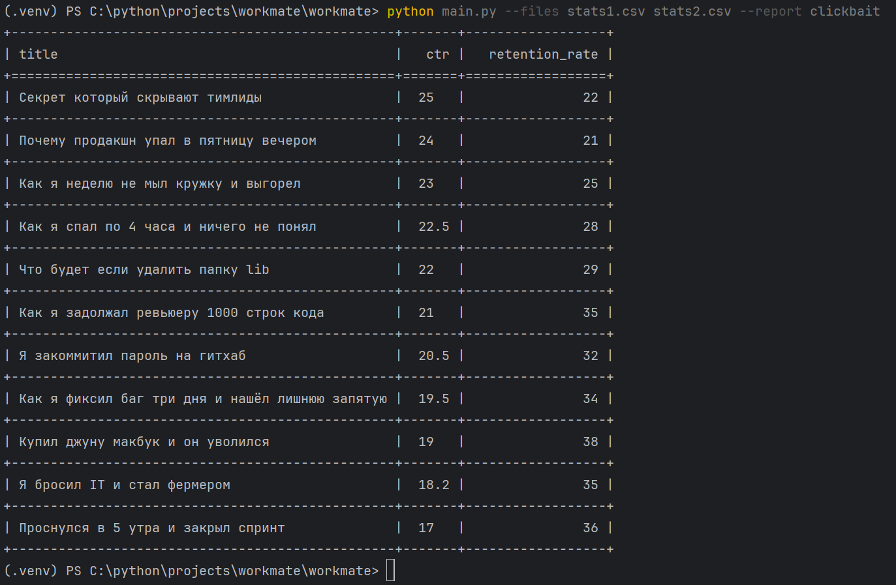
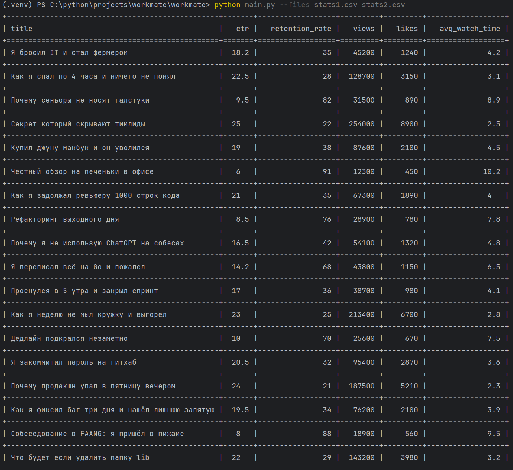

# Тестовое задание для Workmate. Автор Самуйлов Артём.
Приложение читает файлы csv и формирует отчёты. Названия файлов передаются в виде параметра __--files__ (имена файлов передаютс через пробел), тип отчёта - в виде __--report__ (существует только отчёт clickbait, если параметр не указать, будет выведен список всех данных из файлов в консоль).
#### Примеры запуска: 
  - _python main.py --files stats1.csv stats2.csv --report clickbait_
    
  - _python main.py --files stats1.csv stats2.csv_
    
## main.py
При написании кода использовал объектно-ориентрованный подход с наследованием. Внутри три класса:
  - _MainReport_ - родительский класс для любого отчёта. Описана логика открытия файлов, объединения данных.
  - _ClickbaitReport_ - дочерний класс класса _MainReport_. Описана дополнительная логика _clickbait_ отбора нужных данных с сортировкой. Новый тип отчёта можно добавить созданием ещё одного дочернего класса _MainReport_ и добавлением соответствующих данных в словарь _REPORTS_ класса _Handler_.
  - _Handler_ - класс с логикой чтения параметров из командной строки, взаимодействия с классами отчётов, выводом результатов в коносль, обработкой ошибок в случае указания неверного файла или несуществующего отчёта.
## test_main.py
К заданию прилагаются тесты pytest:
  - Проверка фильтра _ctr_ > 15 и _retention_rate_ < 40.
  - Сравнение выходного списка после работы фильтра.
  - Проверка вывода при неверном имени отчёта.
  - Проверка вывода при неверном указании файлов.
  - Проверка корректности результата через обработчик.
